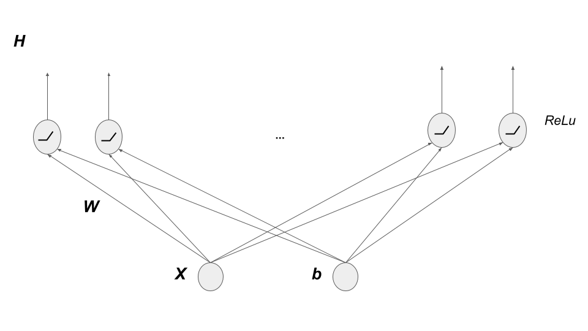
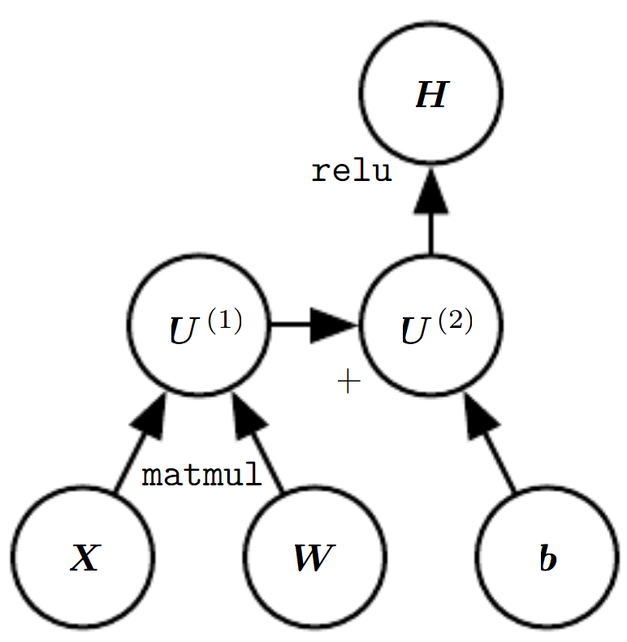
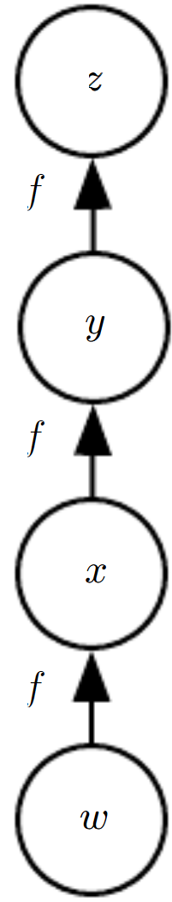
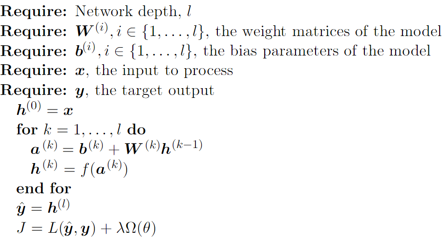
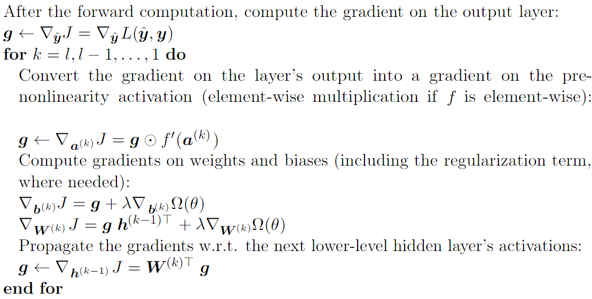
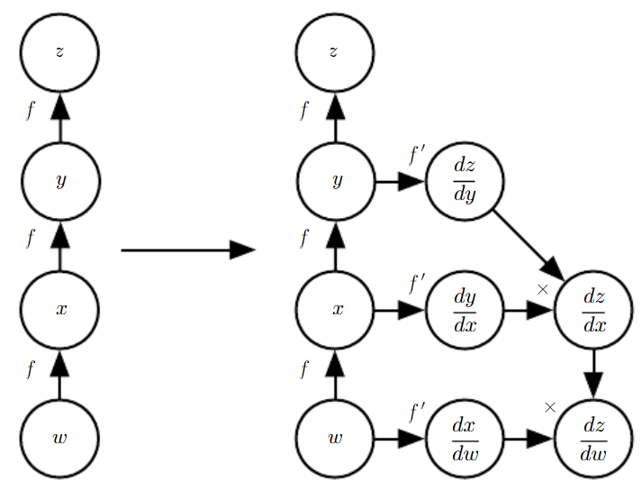
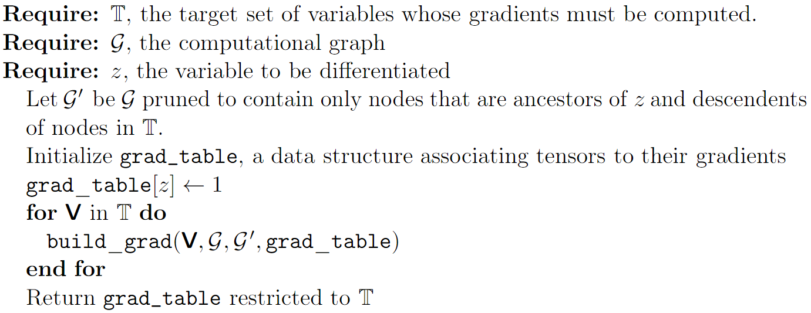
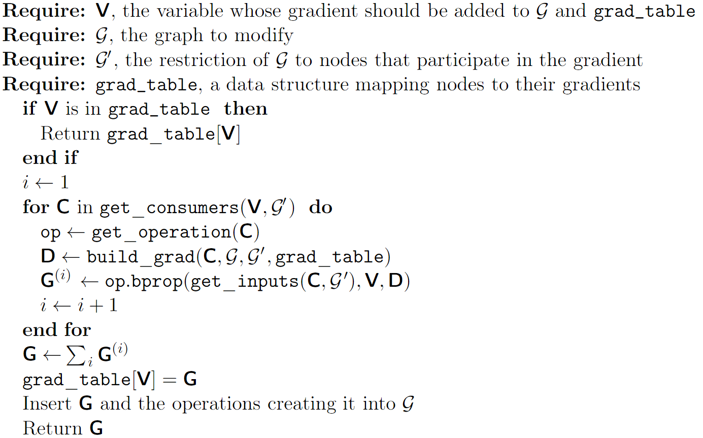
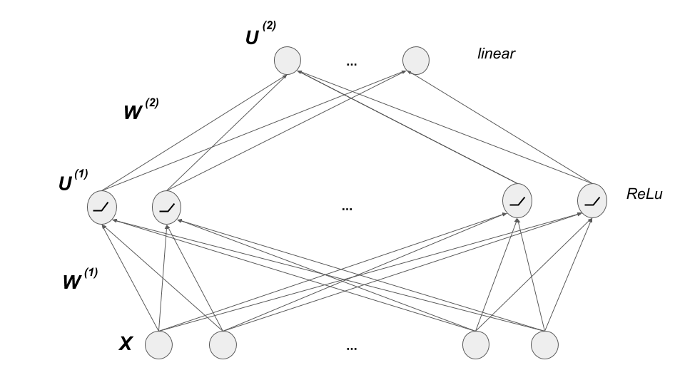
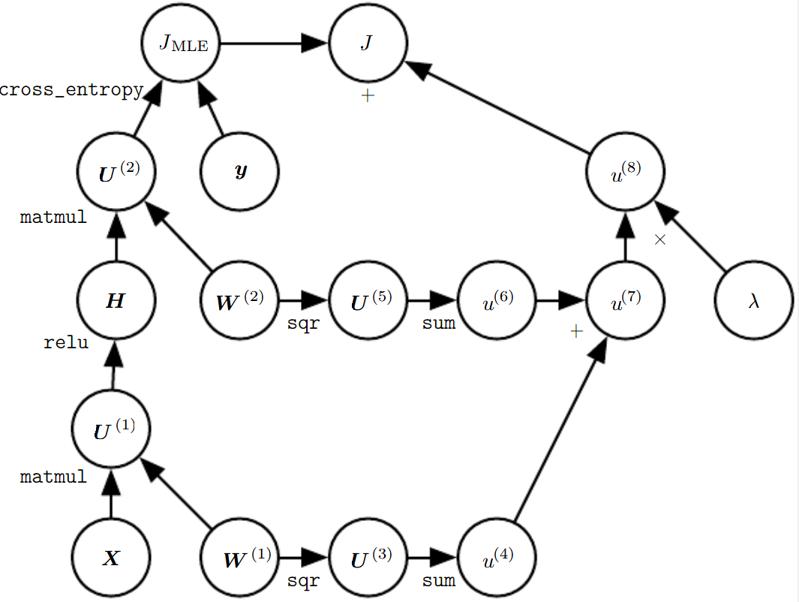

# Back-Propogation 

Navid Shokouhi

Source:
    I. Goodfellow, Y. Bengio and A. Courville, Deep Learning. MIT Press, 2016. (Sections 6.5) http://www.deeplearningbook.org

Back-propagation is a method used in neural networks to calculate gradients of the network loss function with respect to network parameters.

Back-propagation is typically used as part of gradient descent. 

Back-propagation is not an optimization procedure, but rather an efficient way of implementing the chain rule of derivatives. 

## Outline
1. [Computational Graphs](#1)
2. [Chain Rule of Calculus](#2)
3. [Recursively applying chain rule to obtain back-propagation](#3)
4. [Back-Propagation Computation in Fully Connected MLP](#4)
5. [Symbol-to-Symbol Derivatives: Implementation of Back-propagation](#5)
6. [General Back-Propagation](#6)
7. [Example: Back-Propagation for MLP Training](#7)
8. [Other topics](#8)
    1. [Complications](#9)
    2. [Differentiation outside the Deep Learning Community](#10)
    3. [Higher-Order Derivatives](#11)

## Computational Graphs

**computational graphs** provide a functional depiction of the network that can be directly linked to how gradients are calculated. 

In a computational graph, each **node** is used to represent a variable (inputs, outputs, and 
network parameters). 

A **variable** in the context of neural networks could be scalar, vector, matrix, or more generally a tensor. 

Nodes in a computation graph are connected through **functions**, also known as **operations**. 

Computational graphs are conventional diagrams used for neural networks and are mostly useful as a heuristic guideline of the general feedforward architecture of the network (see Fig.1). 
Without loss of generality, an operation can be defined to return only a single output variable, which itself can be multivariate. 

 

### Generating a computational graph from a neural network diagram:
We start by setting a node for each variable. 

Each node may have one or more **parent nodes**, whose associated variables are used to calculate the current node's variable. 

Parents are connected to the **consumer** node using directed edges, with a small lable at the junction, specifying the type of operation. 

## Chain Rule of Calculus

Back-propagation implements the chain rule of derivatives. 

The chain rule of derivative is used to calculate the gradient of nested functions. 

$$y = g(x),$$

$$z = f(y),$$

$x\in R^n$, $y\in R^m$, $z\in R$, 

$f:R^m\rightarrow R$, and $g:R^n\rightarrow R^m$. 

The derivative of $z$ with respect to each entry $x_i$ of $x$ for $i=1,\dots,n$ is:

$$\frac{\partial z}{\partial x_i} = \sum_{j=1}^{m}\frac{\partial z}{\partial y_j}\frac{\partial y_j}{\partial x_i},$$

Using the $R^{n\times m}$ Jacobian matrix between $y$ and $x$, denoted as $\frac{\partial {y}}{\partial {x}}$, we have:

$$\nabla_{x}z = \Big(\frac{\partial {y}}{\partial { x}}\Big)^\top\nabla_{y}z,$$

Notice the recursive steps required to calculate $\nabla_{\bf x}z$. 

The equation stated above is for when ${ x}$ is a vector. The extended case in which ${x}$ is a matrix (say ${X}$) requires tensor operations. 

This case can still be reformulated to our canonical chain rule equation by vectorizing the matrices. 

To account for the general tensor scenario, we use the following notation. 

$$\nabla_{ X}z = \sum_{j = 1}^{\# { Y}}\nabla_{X}Y_j\frac{\partial z}{\partial Y_j}$$

${ X}$ and ${ Y}$ are tensors, 

$\# { Y}$ denotes the number of elements in the tensor ${ Y}$, 

${Y_j}$ represents the $j^{th}$ entry of the tensor after vectorization. 

### NOTE:
Back-Propagation is often confused with gradient descent. 

Back-propagation is one of the many possible **implementations of the chain rule**.  

## Recursively Applying the Chain Rule to Obtain Backprop
We can extend this notion to multiple nested functions.

e.g., each $\nabla_{ X}Y_j$ is calculated from some 
other gradient, $\nabla_{X}Q_j$, etc. 

### Example: Repeated sub-expressions when computing the gradient

Let $w\in R$ be the input to a graph. 

We use the function $f:R\rightarrow R$ in a loop, such that:

$$x = f(w)$$

$$y = f(x)$$

$$z = f(y)$$

The goal is to calculate $\frac{\partial z}{\partial w}$. 

Using the chain rule, we have:

$$\frac{\partial z}{\partial w} = f'(f(f(w)))f'(f(w))f'(w),$$

where $f'$ denotes the derivative of with respect to its argument. 

A naive calculation of $\frac{\partial}{\partial w}z$ requires calculating $f(w)$ twice. 

[Example](dp_fibonacci.slides.html)

The previous example shows that in computing the gradient, "lower-level" values are more likely to be repeated. The way back-propogation addresses these repetitions is by first calculating these values through a forward pass (called forward-propagation) and stores the values in memory. After these values are calculated, everytime back-propagation reaches a new gradient in the chain rule, it first checks whether it has been stored 
in memory before attempting to calculate it. 

The back-propagation algorithm is designed to reduce the number of common sub-expressions without regard to memory. Precisely, the amount of computation required for performing the back-propagation scales linearly with the number of edges in the computational graph, which correspond to connections between
parent and consumer nodes. 

It is often the case that we consider the computation per edge to be $O(1)$. 

## Back-Propagation Computation in Fully Connected MLP
We look at back-propagation to calculate gradients in a generic directed graph. 

Now consider a feed-forward neural network with:

layers (aka nodes) ${\bf h}^{(k)}$ for $k={0,\dots,l}$

${\bf h}^{(0)}$ represents the input layer 

${\bf h}^{(l)}$ the output layer. 

This is a network with **depth $l$**. 

The weights and bias variables connecting $h^{k-1}$ to $h^{k}$ are denoted as ${\bf W}^{(k)}$ and  ${\bf b}^{(k)}$. 

Define: 

$f(.)$ an element-wise non-linear activation function, 

$\hat{\bf y}$ output estimated by the network,

$L(.,.)$ loss function, 

$\Omega(.)$ regularization function.

$J$ total cost; sum of $L$ and $\Omega$. 

The gradient is the partial derivative of $J$ with respect to the network variables ${\bf W}^{(k)}$ and ${\bf b}^{(k)}$. 

We initially calculate all node variables in a **forward propagation step**

To calculate the gradients, the **back-propagation step** is as follows:

Each intermediate gradient is calculated exactly once.

$\Rightarrow$ The overal backword calculations is $O(l)$.

Calculating $\nabla_{\bf W^{(k)}}J$ or $\nabla_{\bf b^{(k)}}J$ in a naive way is to ignore the relation between the parent layer $k-1$ with the child (i.e., consumer) layer $k$. 

The number of computations in the naive approach is exponentially higher. 

## Symbol-to-Symbol Derivatives: Implementation of Back-propagation
Using numerical values for inputs, we can set numerical values for the gradient corresponding to those input values.

this approach is called **symbol-to-number derivative** implementation. 

e.g., Torch, Caffe. 

Alternatively, 

Some software packages (e.g., Tensorflow and Theano) include derivates as additional nodes in the graph. 

When the graph is "evaluated" using actual numeric values, these so called symbols are calculated the same way any other variable is calculated. 

This approach is referred to as the **symbol-to-symbol** implementation.  

## General Back-Propagation

Back-propagation is certain case of a class of algorithms called *Dynamic Programming* (DP).

As in any recursive function, the chain rule uses "parent" variables to calculate the gradient. 

The parents then go through the same chain rule until we reach the inputs. 

Using the following definitions, we can formulate a generic version of the back-propogation procedure:

- graph *G*: computational graph
- variable V: Tensor variable corresponding to a node. 
	${\bf V}$ comes with some subroutines. 
	- `get_consumers`: return "children" of current node. 
	- `get_inputs`: return parents of the current node. 
- T: the target set of nodes for which gradients are calculated. 
- operation `op`: Describes how variable is generated from its parents. Each node comes with an operation.
(e.g., `matmul` is an operation associated with matrix multiplicatoin).

- some useful methods of an `op`:
	- `op.f` the mathematical function of `op`.
	- `op.bprop` the backpropagation procedure specific to an operation. 

Also define the graph *G'* that only contains nodes that participate in the gradient. 

The objective is to find the gradient ${\bf G}$, which alongside all the other intermediate gradients is stored in the memoization variable `grad_table`. 

The algorithm above uses the function `build_grad` to calculate the gradients for each node. 

`build_grad` is the core of the back-propagation function and is defined as:

Example: 
`op.bprop` for a `matmul` opreation with inputs $A$ and $B$ (i.e., $V = AB$)

There are two sub-terms, corresponding to $A$ and $B$.

If the current gradient is $G$, the back-propogation is

$$A^\top G + G B^\top$$

comprised of gradient w.r.t to $B$ and $A$, respectively. 

In general, back-propagation at each node returns $\sum_i (\nabla_{X}$ `op.f` $($ `inputs` $)_i)G_i$

## Example: Back-Propagation for MLP Training

Consider a multi-layer perceptron with a single-hidden layer designed for a classification task, for which we are given

a set of training features ${\bf X}_{train}$ 

their corresponding labels presented in the 
matrix ${\bf Y}_{train}$ containing 1-hot vectors for each training example. 

Assume that each row corresponds to 
a sample. 

In minibatch stochastic gradient descent, a subset of ${\bf X}_{train}$ is selected, namely ${\bf X}$ in each iteration of 
gradient descent alongside the corresponding labels ${\bf Y}$. 

We will go through a single step of gradient descent given the minibatch (${\bf X}, {\bf Y}$). 

The network architecture is comprised of (in this order): 

- Input layer: whose size is equal to the dimension of features in each sample of ${\bf X}$
- Fully connected linear weights $W^{(1)}$ that map each row in ${\bf X}$ to ${\bf U^{(1)} = XW^{(1)}}$ 
- A sample-wise non-linear ReLu activation layer that disgards negative entries in ${\bf U^{(1)}}$, let us call the outputs ${\bf H}$
- Another fully connected set of linear weights that maps each row in ${\bf H}$ to ${\bf U^{(2)} = HW^{(2)}}$ 
- Output layer loss is calculated using the cross-entropy between ${\bf Y}$ and the unnormalized log-probabilities represented by $U^{(2)}$. 

For a binary classification example, maximum likelihood estimation (MLE) loss is:

$$J_{MLE} = \sum_{n=1}^{\# minibatch}{\bf y}_n\log(U^{(2)}_n) + (1 - {\bf y}_n)\log(1 - U^{(2)}_n).$$

Plus a regularization with Lagrange coefficient $\lambda$:

$$J_{reg} = \lambda\left(\sum_{i,j}{W^{(2)}}^2(i,j) + \sum_{i,j}{W^{(1)}}^2(i,j)\right).$$

Total loss:
$J = J_{MLE} + J_{reg}$. 

**Step 1:** Computational graph

**Step 2:** Forward pass calculates all node parameters using current value of parameters. 

**Step 3:** Backward disection of all paths form $J$ to ${\bf W^{(1)}}$ and ${\bf W^{(2)}}$. 

- *Path 1: 	Regularization path*: 
    This is a a fairly straight-forward path, because the gradients of $J$ along this path are simply: $2\lambda{\bf W^{(1)}}$ and $2\lambda{\bf W^{(2)}}$
- *Path 2:	Cross-entropy path*:
    This path is a bit more complicated as it requires using the chain-rule more than once, which itself creates several sub-paths.
    - *Path 2.1:* $\nabla_{\bf U^{(2)}} : {\bf G}$
        - *Path 2.1.1:* $\nabla_{\bf W^{(2)}} : {\bf H}$
        - *Path 2.1.2:* $\nabla_{\bf H} : {\bf W^{(2)\top}}$
            - *Path 2.1.2.1:* $\nabla_{\bf U^{(1)}} : {\bf G'} = 1 | 0$ (ReLu differentiation; element-wise ones or zeros)
                - *Path 2.1.2.1.1:* $\nabla_{\bf W^{(1)}} : {\bf X^\top}$

The advantage of the back-propagation algorithm is evident from the fact that all of the parameters required for each path 
is already pre-computed. Therefore, with the additional cost of storing values such as $H$, we can directly use it to 
calculate the gradient using the backward pass. Notice that the number of operations is the number of paths (i.e., edges) and 
not the number of operations required by the chain rule. 
			

## Other topics
The topics discussed so far in this section addressed the core concepts of back-propagation. However, there are several other 
aspects that were not discussed and are briefly mentioned here for the curious reader. 

### Complications
Some technical considerations:
- Efficient methods for computing and employing other parameters during back-propagation (to save computation). 
- Direct calculation of summation of multiple tensors (to save memory).  
- Details regarding floating point operations. 
- Addressing singularity points in calculating gradients (e.g., in ReLu). 

To ensure the scalability of back-propagation, all these items must be addressed. 

### Differentiation outside the Deep Learning Community
Back-propagation is one of many ways to implement the chain rule with some level of efficiency. 

It is a special case of a class of techniques called **reverse mode accumulation**, which itself is one of many classes of techniques in the field of 
**automatic differentiation**. 

The reason we say that back-propagation only has "some level of efficiency" is that finding the optimal sequence of calculations in automatic 
differentiation is an NP-hard problem. Although back-propagation is able to reduce the overall number of calculations for deep networks by 
employing memoization, it does not provide general guidelines to efficiently calculate function (i.e., operation) differentiation. There is no
commonly used framework in machine learning that improves function differentiation, unless the developer specifically implements an efficient 
implementation for differentiating a certain (pre-determined) group of operations. 

### Higher-Order Derivatives
In some instances of training a DNN, higher-order derivatives can help improve gradient descent procedure. 

For example, the second-order derivative (i.e., Hessian matrix of the loss function), can be used 
as a guidance parameter during gradient descent iterations. 

An example is **momentum** learning for which the Hessian is added as a step-size for the gradient. 

An online publication by [Goh (2017)](https://distill.pub/2017/momentum/) comes with interactive figures and gives great intuition about the role of momentum in optimization. 

In most applications, calculating the Hessian is considered computationally expensive and therefore it is rarely used for large scale problems. 
For example, in a DNN with a scalar output and $n$ model parameters the Hessian is an $n\times n$ matrix. 
Therefore, calculating the Hessian  for large $n$ may not be worth-while. 

!!!	Note 
	Sometimes the iterative Krylov techniques are used to estimate the Hessian matrix in certain directions. 

## Acknowledgements
Some figures and algorithms were copied from the deep learning book. 
    I. Goodfellow, et al, Deep Learning. MIT Press, 2016.

This summary was written by Navid Shokouhi and reviewed by Selwyn Gomes.
